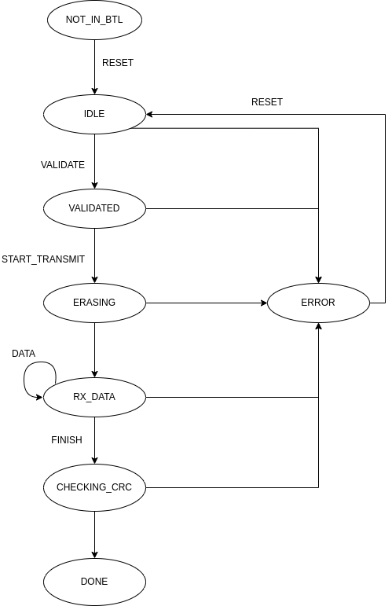

# Bootload Protocol

By default the bootload protocol is placed on the DDP endpoint `0x10`.

## Request and Response Format

### Request Format

| Byte `0` | Byte `1` | Bytes `2` to `n`       |
| -------- | -------- | ---------------------- |
| Node-ID  | Command  | Command Dependent Data |

### Response Format

| Byte `0` | Byte `1` | Bytes `2`  |
| -------- | -------- | ---------- |
| Node-ID  | State    | Error Code |

Where:

- THe Node-ID defines which MCU is update in case of a multi-MCU system. If a single MCU is updated, this value should be 1.
- Command, State and Error Codes are defined in the table below
- Note that the error code is latched when the first error occurs and can only be cleared by sending a _RESET_ command
  Thus, the error code does not necessarily represent the validity of the request frame.

| Updater Command  | Code   | Description                                                                                                                |
| ---------------- | ------ | -------------------------------------------------------------------------------------------------------------------------- |
| _NONE_           | `0x00` | Performs no action. Allows reading back the state.                                                                         |
| _RESET_          | `0x0`  | Resets the bootloader into _IDLE_ mode.                                                                                    |
| _VALIDATE_       | `0x02` | Sends validation data to validate the firmware to be updated against the version in the MCU                                |
| _START_TRANSMIT_ | `0x03` | Tells the MCU to become ready to accept image data. For example, the MCU may erase some flash if it receives this command. |
| _DATA_           | `0x04` | Send image data to the bootloader                                                                                          |
| _FINISH_         | `0x05` | Tells the MCU that data transmission has finished.                                                                         |
| _LEAVE_          | `0x06` | Leave the bootloader and start the application.                                                                            |

| Updater State  | Code   | Description                                              |
| -------------- | ------ | -------------------------------------------------------- |
| _NOT_IN_BTL_   | `0x00` | The application is not in update-mode                    |
| _IDLE_         | `0x01` | The bootloader is idle and updating can start            |
| _VALIDATED_    | `0x02` | The image version has been validated and was accepted    |
| _ERASING_      | `0x03` | The bootloader is in process of erasing the flash        |
| _RX_DATA_      | `0x04` | The bootloader is accepting image data                   |
| _CHECKING_CRC_ | `0x05` | The bootloader is verifying the CRC of the updated image |
| _DONE_         | `0x06` | The bootloader has successfully finished                 |
| _ERROR_        | `0x07` | An error has occurred                                    |

| Bootload Error             | Code   | Description                                             |
| -------------------------- | ------ | ------------------------------------------------------- |
| _SUCCESS_                  | `0x00` | No error has occurred                                   |
| _UNEXPECTED_CMD_           | `0x01` | The command was not expected in the current state       |
| _INVALID_CMD_              | `0x02` | The command was invalid                                 |
| _INVALID_FRAME_LENGTH_     | `0x03` | The frame length was not matching the expected value    |
| _INCOMPATIBLE_             | `0x04` | The firmware images are incompatible                    |
| _OUT_OF_BOUNDS_            | `0x05` | The data to be written was out of bounds                |
| _NOT_READY_                | `0x06` | The bootloader was not ready to receive data            |
| _INVALID_LENGTH_IN_HEADER_ | `0x07` | The firmware length encoded in the header was not valid |
| _FLASH_                    | `0x08` | A flash error has occurred                              |
| _INVALID_CRC_              | `0x09` | The checksum verification of the image has failed       |

## State Machine

The following diagrams shows the state machine of the bootloader and how to transition between states.
Note that a _RESET_ command can by sent at anytime. It will reset the bootloader back into _IDLE_ state.

## Command Description and Data Format

| Command          | Data          | Length                  | Description                                                                                                                                                                                                 |
| ---------------- | ------------- | ----------------------- | ----------------------------------------------------------------------------------------------------------------------------------------------------------------------------------------------------------- |
| _RESET_          |               |                         | Resets the state machine back to IDLE. In case the MCU is not in bootload mode (NOT_IN_BTL), it enters bootload mode.                                                                                       |
| _VALIDATE_       | Product ID    | 2 bytes                 | The 16bit product ID encoded in little endian                                                                                                                                                               |
|                  | Major Version | 2 bytes                 | The 16bit major version encoded in little endian                                                                                                                                                            |
|                  | BTL Version   | 1 byte                  | The version of the bootloader / protocol                                                                                                                                                                    |
| _START_TRANSMIT_ |               |                         | Trigger the MCU to erase its flash. Once the flash has been erased, the bootloader state machine will enter the RX_DATA state and is ready to receive data.                                                 |
| _DATA_           | Data offset   | 4 bytes                 | Address offset in the firmware image                                                                                                                                                                        |
|                  | Image data    | 16 bytes (configurable) | Image data at the given offset address                                                                                                                                                                      |
| _FINISH_         |               |                         | Tells the MCU that writing the image has finished and that the resulting image should be checked for validity. The state machine will enter the CHECKING_CRC state. Upon success, it enters the DONE state. |
| _LEAVE_          |               |                         | Leaves the bootloader. If uploading the image was successful, the MCU will reboot into the new firmware image.                                                                                              |

### Notes

The data frame length of 16 bytes is only a default value. It can be configured using the config key `images[k].write_data_size`.
For simplicity of implementation it is recommended to stay within factors of 2.
Also consider potential requirements for flash writes and ECC codes.
